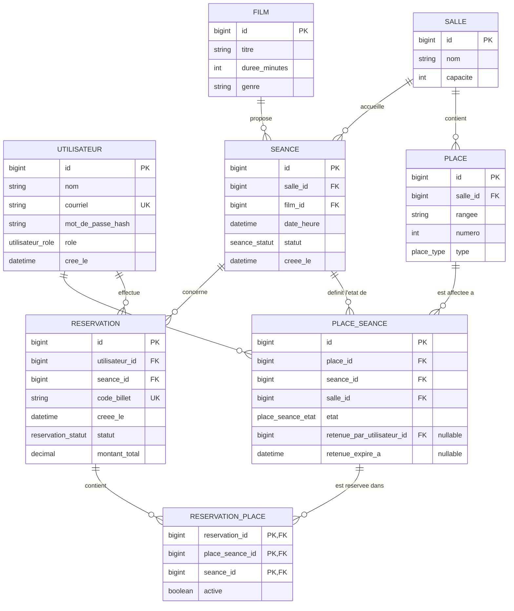

[03-conception.md](https://github.com/user-attachments/files/31762367/03-conception.md)
# Conception technique

## Modèle de données cohérent

Le modèle initial contient l'idée juste, mais il manque des contraintes de cohérence indispensables pour un système de réservation à forte concurrence. Les points corrigés sont les suivants :

- une place ne peut apparaître qu'une seule fois pour une séance donnée;
- une réservation ne peut pas contenir deux fois la même place;
- une place retenue doit avoir un utilisateur propriétaire;
- une place `vendue` ne peut plus être retenue ni vendue une seconde fois;
- le plan de salle doit être cohérent avec la salle de la séance.

### Diagramme ER corrigé



### Erreurs corrigées dans le modèle

1. `PLACE_SEANCE` doit avoir une contrainte `UNIQUE (place_id, seance_id)` pour éviter une duplication d'état pour la même place et la même séance.
2. `RESERVATION_PLACE` devient une table de jointure fiable avec clé composite `(reservation_id, place_seance_id)` et un indice unique partiel sur `place_seance_id` lorsque `active = true`, ce qui permet l'annulation sans verrouiller définitivement la place.
3. `SEANCE` est rattachée à une `SALLE` précise ; la relation `place_seance` conserve aussi `salle_id` pour garantir qu’une place d’une salle ne peut pas être associée à une séance d’une autre salle.
4. Le statut et le propriétaire de la retenue doivent être cohérents : si `etat = 'retenue'`, alors `retenue_par_utilisateur_id` est non nul et `retenue_expire_a` est non nul; sinon les deux doivent être nuls.
5. Une place vendue ne doit pas pouvoir être réutilisée par une autre réservation ; la logique de validation passe par un verrou pessimiste sur `PLACE_SEANCE` et par un index unique partiel `WHERE active` pour empêcher toute réattribution active d’une place déjà vendue.
6. `reservation_place` contient aussi `seance_id` pour garantir que les places réservées correspondent bien à la séance de la réservation.

### Table de référence PostgreSQL

```sql
CREATE TYPE utilisateur_role AS ENUM ('spectateur', 'gestionnaire');
CREATE TYPE seance_statut AS ENUM ('ouverte', 'fermee', 'annulee');
CREATE TYPE place_type AS ENUM ('standard', 'accessible');
CREATE TYPE place_seance_etat AS ENUM ('libre', 'retenue', 'vendue');
CREATE TYPE reservation_statut AS ENUM ('confirmee', 'annulee');

CREATE TABLE utilisateur (
    id BIGSERIAL PRIMARY KEY,
    nom VARCHAR(120) NOT NULL,
    courriel VARCHAR(255) NOT NULL UNIQUE,
    mot_de_passe_hash VARCHAR(255) NOT NULL,
    role utilisateur_role NOT NULL DEFAULT 'spectateur',
    cree_le TIMESTAMPTZ NOT NULL DEFAULT NOW()
);

CREATE TABLE salle (
    id BIGSERIAL PRIMARY KEY,
    nom VARCHAR(150) NOT NULL,
    capacite INTEGER NOT NULL CHECK (capacite > 0)
);

CREATE TABLE film (
    id BIGSERIAL PRIMARY KEY,
    titre VARCHAR(255) NOT NULL,
    duree_minutes INTEGER NOT NULL CHECK (duree_minutes > 0),
    genre VARCHAR(100)
);

CREATE TABLE place (
    id BIGSERIAL,
    salle_id BIGINT NOT NULL,
    rangee VARCHAR(20) NOT NULL,
    numero INTEGER NOT NULL,
    type place_type NOT NULL DEFAULT 'standard',
    PRIMARY KEY (id, salle_id),
    UNIQUE (salle_id, rangee, numero),
    FOREIGN KEY (salle_id) REFERENCES salle(id) ON DELETE RESTRICT
);

CREATE TABLE seance (
    id BIGSERIAL,
    salle_id BIGINT NOT NULL,
    film_id BIGINT NOT NULL,
    date_heure TIMESTAMPTZ NOT NULL,
    statut seance_statut NOT NULL DEFAULT 'ouverte',
    creee_le TIMESTAMPTZ NOT NULL DEFAULT NOW(),
    PRIMARY KEY (id, salle_id),
    FOREIGN KEY (salle_id) REFERENCES salle(id) ON DELETE RESTRICT,
    FOREIGN KEY (film_id) REFERENCES film(id) ON DELETE RESTRICT,
    UNIQUE (id, salle_id)
);

CREATE TABLE place_seance (
    id BIGSERIAL PRIMARY KEY,
    place_id BIGINT NOT NULL,
    salle_id BIGINT NOT NULL,
    seance_id BIGINT NOT NULL,
    etat place_seance_etat NOT NULL DEFAULT 'libre',
    retenue_par_utilisateur_id BIGINT,
    retenue_expire_a TIMESTAMPTZ,
    UNIQUE (place_id, seance_id),
    FOREIGN KEY (place_id, salle_id) REFERENCES place(id, salle_id) ON DELETE RESTRICT,
    FOREIGN KEY (seance_id, salle_id) REFERENCES seance(id, salle_id) ON DELETE CASCADE,
    CHECK (
        (etat = 'retenue' AND retenue_par_utilisateur_id IS NOT NULL AND retenue_expire_a IS NOT NULL)
        OR
        (etat <> 'retenue' AND retenue_par_utilisateur_id IS NULL AND retenue_expire_a IS NULL)
    )
);

CREATE TABLE reservation (
    id BIGSERIAL PRIMARY KEY,
    utilisateur_id BIGINT NOT NULL REFERENCES utilisateur(id) ON DELETE RESTRICT,
    seance_id BIGINT NOT NULL,
    code_billet VARCHAR(50) NOT NULL UNIQUE,
    creee_le TIMESTAMPTZ NOT NULL DEFAULT NOW(),
    statut reservation_statut NOT NULL DEFAULT 'confirmee',
    montant_total NUMERIC(10,2) NOT NULL CHECK (montant_total >= 0),
    UNIQUE (id, seance_id),
    FOREIGN KEY (seance_id) REFERENCES seance(id) ON DELETE RESTRICT
);

CREATE TABLE reservation_place (
    reservation_id BIGINT NOT NULL,
    place_seance_id BIGINT NOT NULL,
    seance_id BIGINT NOT NULL,
    active BOOLEAN NOT NULL DEFAULT TRUE,
    PRIMARY KEY (reservation_id, place_seance_id),
    FOREIGN KEY (reservation_id) REFERENCES reservation(id) ON DELETE CASCADE,
    FOREIGN KEY (place_seance_id, seance_id) REFERENCES place_seance(id, seance_id) ON DELETE RESTRICT,
    FOREIGN KEY (reservation_id, seance_id) REFERENCES reservation(id, seance_id) ON DELETE CASCADE,
    CHECK (seance_id IS NOT NULL)
);

CREATE UNIQUE INDEX uq_place_vendue_une_fois
    ON reservation_place (place_seance_id)
    WHERE active;

CREATE INDEX idx_place_seance_etat ON place_seance (seance_id, etat);
CREATE INDEX idx_place_seance_retenue ON place_seance (retenue_par_utilisateur_id, retenue_expire_a);
CREATE INDEX idx_reservation_utilisateur ON reservation (utilisateur_id, creee_le DESC);
CREATE INDEX idx_reservation_seance ON reservation (seance_id);
```

Cette version reste compatible avec le besoin de concurrence SQL décrit dans le projet : la réservation et la rétention passent par un verrou pessimiste sur `PLACE_SEANCE` (`SELECT ... FOR UPDATE`) puis la confirmation écrit dans `RESERVATION` et `RESERVATION_PLACE` dans une seule transaction. La logique d’annulation est également compatible avec le sprint 2 : on passe `active = false` sur les lignes de `reservation_place` et on remet la place à `libre` sans casser l’intégrité de la base.

## Principales routes et événements temps réel

### Pages (sprint 1)

| Route                        | Rôle                                                                   |
| ---------------------------- | ---------------------------------------------------------------------- |
| `/connexion`, `/inscription` | Authentification (#1)                                                  |
| `/seances`                   | Liste des séances à venir (#2)                                         |
| `/seances/:id`               | Plan de salle en direct, sélection et rétention de places (#4, #5, #6) |
| `/mes-reservations`          | Confirmation et billet obtenu (#7)                                     |
| `/gestion/seances/nouvelle`  | Création d'une séance sur un plan de salle, côté gestionnaire (#3)     |

### API (sprint 1)

| Endpoint                                                 | Rôle                                                       |
| -------------------------------------------------------- | ---------------------------------------------------------- |
| `POST /api/auth/inscription`, `POST /api/auth/connexion` | #1                                                         |
| `GET /api/seances`                                       | #2                                                         |
| `POST /api/seances`                                      | #3 — gestionnaire seulement                                |
| `GET /api/seances/:id/plan`                              | État de chaque place pour cette séance (#4)                |
| `POST /api/seances/:id/places/:placeId/retenir`          | Retenir une place le temps de finaliser (#5)               |
| `POST /api/reservations`                                 | Confirmer — transforme les places retenues en vendues (#7) |

Pour les sprints 2 et 3, seules les grandes familles sont nommées pour l'instant : `/api/billets` (validation à l'entrée, #11), `/api/reservations/:id` (annulation, #9), `/api/utilisateurs/:id/role` (#14).

### Événements temps réel (Socket.IO)

- Le client rejoint une *room* Socket.IO par séance en arrivant sur `/seances/:id`.
- `place:etat_change` — émis par le serveur à tous les clients de la room dès qu'une place change d'état (retenue, vendue, libérée). C'est cet événement qui fait vivre #6.
- `place:retenue_expiree` — émis quand une rétention expire sans confirmation; la place redevient `libre` chez tout le monde.

Le client n'émet aucun événement : les actions (retenir, confirmer) passent par l'API REST ci-dessus. Socket.IO ne sert qu'à écouter les changements — c'est un choix pour garder une seule voie d'entrée pour les écritures (plus simple à protéger avec le verrouillage de D1), pas un oubli.

## Maquettes

`maquettes/` — 4 écrans clés, dont obligatoirement `/seances/:id` (l'écran temps réel) :

1. Liste des séances à venir
   

2. **Plan de salle et sélection de places** (obligatoire — écran temps réel)
   

3. Confirmation de réservation / billet
   

4. Connexion / inscription
   

## Registre de décisions

### D1 — Comment empêcher que deux personnes réservent la même place ?

- **La question.** La rétention de place (#5) et le changement d'état en direct (#6) sont le vrai point de risque du projet : deux spectateurs peuvent cliquer sur la même place au même instant.
- **Options envisagées.** (a) Verrouillage optimiste — une colonne de version, l'écriture est rejetée si la version a changé depuis la lecture; (b) verrouillage pessimiste en base (`SELECT ... FOR UPDATE`) le temps de la transaction qui retient ou vend la place; (c) rétention gérée en mémoire (ex. Redis avec expiration automatique), la base ne stockant que l'état confirmé.
- **Décision.** Verrouillage pessimiste en base sur la ligne `PLACE_SEANCE`, au moment de la rétention et de la confirmation.
- **Raison.** Une seule transaction SQL suffit à garantir qu'une place ne peut être retenue ou vendue deux fois, sans service supplémentaire à opérer.
- **Ce que ça coûte.** Si plusieurs personnes visent la même place au même instant, elles attendent en file plutôt qu'en parallèle — acceptable pour quelques dizaines de places par séance.

### D2 — Quelle base de données ?

- **La question.** Le modèle a des relations multiples et le point de concurrence exige des transactions fiables.
- **Options envisagées.** (a) PostgreSQL; (b) MySQL/MariaDB; (c) SQLite.
- **Décision.** PostgreSQL.
- **Raison.** Verrouillage de ligne robuste (`SELECT FOR UPDATE`), transactions ACID, et c'est la base enseignée dans Applications web 2 — support rapide en cas de blocage.
- **Ce que ça coûte.** Un conteneur de plus à gérer dans `docker-compose` comparé à une base embarquée comme SQLite.

### D3 — Quelle technologie pour le temps réel ?

- **La question.** Diffuser l'état des places à tous les clients qui regardent la même séance, en direct.
- **Options envisagées.** (a) Socket.IO par-dessus WebSocket; (b) WebSocket natif; (c) Server-Sent Events (SSE).
- **Décision.** Socket.IO.
- **Raison.** Le concept de *room* correspond exactement à « tous les clients qui regardent la séance X »; reconnexion automatique gérée; techno enseignée dans Applications web 2.
- **Ce que ça coûte.** Une dépendance de plus à apprendre plutôt que les WebSockets natifs du navigateur.

## Notes complémentaires (demandées par le prof, hors sprint 1)

Trois ajouts discutés avec le professeur, esquissés ici, détaillés au raffinement du backlog :

- **Présence en direct** : qui d'autre regarde une place en ce moment. Pas de nouvelle entité en base — une information éphémère diffusée par un nouvel événement Socket.IO, `place:presence`, sur le même modèle que `place:etat_change`.
- **Assistance sur hésitation** : une aide qui apparaît si l'utilisateur reste inactif trop longtemps sur `/seances/:id`. Détecté côté client (minuteur d'inactivité); ne touche pas le modèle de données du sprint 1.
- **Interopérabilité avec des agents externes** : exposer les séances dans un format structuré et lisible par des outils comme ChatGPT (ex. JSON-LD ou schéma ouvert sur `/api/seances`). S'appuie sur l'API déjà prévue, sans nouvelle entité.
