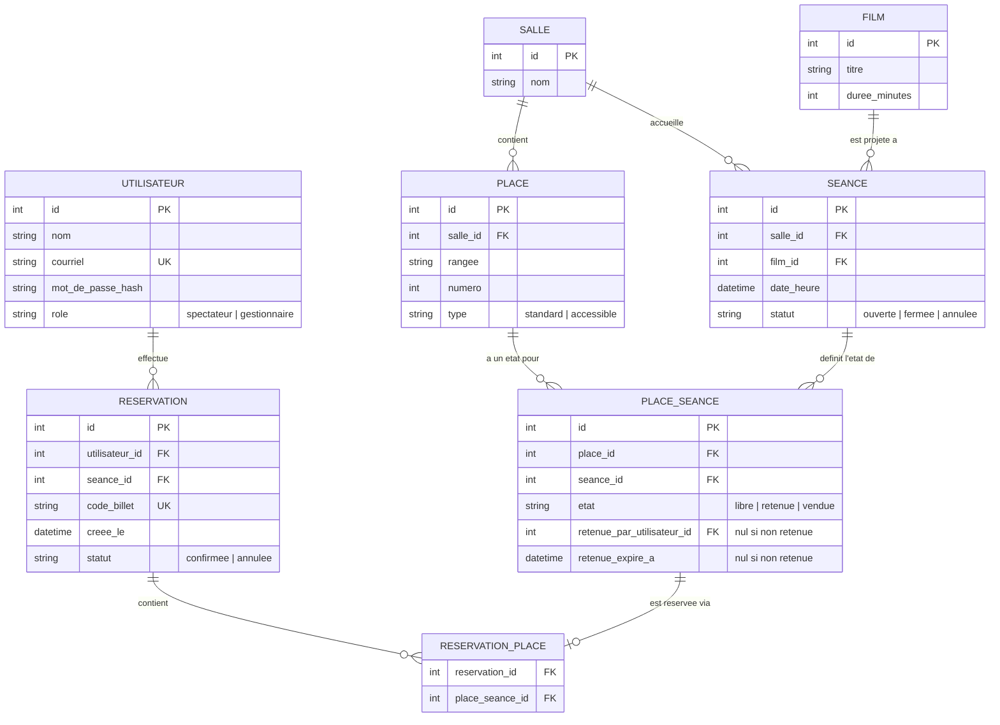

[03-conception.md](https://github.com/user-attachments/files/31762367/03-conception.md)
# Conception technique

## Modèle de données initial

Modèle de données initial

Hypothèse de travail. Les entités touchées par le sprint 1 (PLACE_SEANCE, SEANCE, RESERVATION) sont détaillées; FILM n'est qu'esquissée — elle sera précisée quand les récits should (filtrer par ville/genre, #16) arriveront.

PLACE_SEANCE est l'entité pivot du projet : c'est elle qui porte l'état d'une place pour une séance précise (une même place physique est libre pour une séance et vendue pour une autre). C'est aussi elle que touche le point de concurrence (#5, #6) — voir décision D1.
## Principales routes et événements temps réel

### Pages (sprint 1)

| Route                        | Rôle                                                                   |
| ---------------------------- | ---------------------------------------------------------------------- |
| `/connexion`, `/inscription` | Authentification (#1)                                                  |
| `/seances`                   | Liste des séances à venir (#2)                                         |
| `/seances/:id`               | Plan de salle en direct, sélection et rétention de places (#4, #5, #6) |
| `/mes-reservations`          | Confirmation et billet obtenu (#7)                                     |
| `/gestion/seances/nouvelle`  | Création d'une séance sur un plan de salle, côté gestionnaire (#3)     |

### API (sprint 1)

| Endpoint                                                 | Rôle                                                       |
| -------------------------------------------------------- | ---------------------------------------------------------- |
| `POST /api/auth/inscription`, `POST /api/auth/connexion` | #1                                                         |
| `GET /api/seances`                                       | #2                                                         |
| `POST /api/seances`                                      | #3 — gestionnaire seulement                                |
| `GET /api/seances/:id/plan`                              | État de chaque place pour cette séance (#4)                |
| `POST /api/seances/:id/places/:placeId/retenir`          | Retenir une place le temps de finaliser (#5)               |
| `POST /api/reservations`                                 | Confirmer — transforme les places retenues en vendues (#7) |

Pour les sprints 2 et 3, seules les grandes familles sont nommées pour l'instant : `/api/billets` (validation à l'entrée, #11), `/api/reservations/:id` (annulation, #9), `/api/utilisateurs/:id/role` (#14).

### Événements temps réel (Socket.IO)

- Le client rejoint une *room* Socket.IO par séance en arrivant sur `/seances/:id`.
- `place:etat_change` — émis par le serveur à tous les clients de la room dès qu'une place change d'état (retenue, vendue, libérée). C'est cet événement qui fait vivre #6.
- `place:retenue_expiree` — émis quand une rétention expire sans confirmation; la place redevient `libre` chez tout le monde.

Le client n'émet aucun événement : les actions (retenir, confirmer) passent par l'API REST ci-dessus. Socket.IO ne sert qu'à écouter les changements — c'est un choix pour garder une seule voie d'entrée pour les écritures (plus simple à protéger avec le verrouillage de D1), pas un oubli.

## Maquettes

`maquettes/` — 4 écrans clés, dont obligatoirement `/seances/:id` (l'écran temps réel) :

1. Liste des séances à venir
   

2. **Plan de salle et sélection de places** (obligatoire — écran temps réel)
   

3. Confirmation de réservation / billet
   

4. Connexion / inscription
   

## Registre de décisions

### D1 — Comment empêcher que deux personnes réservent la même place ?

- **La question.** La rétention de place (#5) et le changement d'état en direct (#6) sont le vrai point de risque du projet : deux spectateurs peuvent cliquer sur la même place au même instant.
- **Options envisagées.** (a) Verrouillage optimiste — une colonne de version, l'écriture est rejetée si la version a changé depuis la lecture; (b) verrouillage pessimiste en base (`SELECT ... FOR UPDATE`) le temps de la transaction qui retient ou vend la place; (c) rétention gérée en mémoire (ex. Redis avec expiration automatique), la base ne stockant que l'état confirmé.
- **Décision.** Verrouillage pessimiste en base sur la ligne `PLACE_SEANCE`, au moment de la rétention et de la confirmation.
- **Raison.** Une seule transaction SQL suffit à garantir qu'une place ne peut être retenue ou vendue deux fois, sans service supplémentaire à opérer.
- **Ce que ça coûte.** Si plusieurs personnes visent la même place au même instant, elles attendent en file plutôt qu'en parallèle — acceptable pour quelques dizaines de places par séance.

### D2 — Quelle base de données ?

- **La question.** Le modèle a des relations multiples et le point de concurrence exige des transactions fiables.
- **Options envisagées.** (a) PostgreSQL; (b) MySQL/MariaDB; (c) SQLite.
- **Décision.** PostgreSQL.
- **Raison.** Verrouillage de ligne robuste (`SELECT FOR UPDATE`), transactions ACID, et c'est la base enseignée dans Applications web 2 — support rapide en cas de blocage.
- **Ce que ça coûte.** Un conteneur de plus à gérer dans `docker-compose` comparé à une base embarquée comme SQLite.

### D3 — Quelle technologie pour le temps réel ?

- **La question.** Diffuser l'état des places à tous les clients qui regardent la même séance, en direct.
- **Options envisagées.** (a) Socket.IO par-dessus WebSocket; (b) WebSocket natif; (c) Server-Sent Events (SSE).
- **Décision.** Socket.IO.
- **Raison.** Le concept de *room* correspond exactement à « tous les clients qui regardent la séance X »; reconnexion automatique gérée; techno enseignée dans Applications web 2.
- **Ce que ça coûte.** Une dépendance de plus à apprendre plutôt que les WebSockets natifs du navigateur.

## Notes complémentaires (demandées par le prof, hors sprint 1)

Trois ajouts discutés avec le professeur, esquissés ici, détaillés au raffinement du backlog :

- **Présence en direct** : qui d'autre regarde une place en ce moment. Pas de nouvelle entité en base — une information éphémère diffusée par un nouvel événement Socket.IO, `place:presence`, sur le même modèle que `place:etat_change`.
- **Assistance sur hésitation** : une aide qui apparaît si l'utilisateur reste inactif trop longtemps sur `/seances/:id`. Détecté côté client (minuteur d'inactivité); ne touche pas le modèle de données du sprint 1.
- **Interopérabilité avec des agents externes** : exposer les séances dans un format structuré et lisible par des outils comme ChatGPT (ex. JSON-LD ou schéma ouvert sur `/api/seances`). S'appuie sur l'API déjà prévue, sans nouvelle entité.
